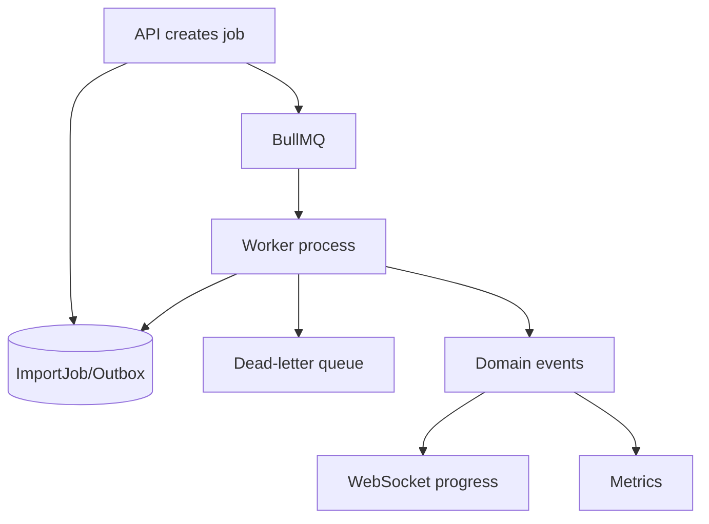
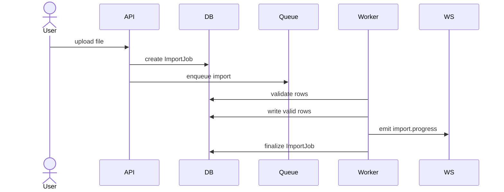

# Async Processing

Status: `IN_DESIGN`

## Scope

BullMQ and Redis should process workloads that are slow, retryable, or external-system dependent:

- CSV/XLSX imports;
- report generation;
- tracking ingestion;
- insight generation;
- external sync;
- notification fan-out.

## Architecture

## Queue Proposal

| Queue | Purpose | Payload |
| --- | --- | --- |
| `imports` | Validate/process uploaded files | `tenantId`, `actorId`, `importJobId`, `fileId`, `type`, `idempotencyKey`, `correlationId` |
| `tracking-ingestion` | Normalize external/imported tracking | `tenantId`, `source`, `externalEventId`, `shipmentRef`, `payloadRef` |
| `reports` | Generate exports and reports | `tenantId`, `actorId`, `reportType`, `filters`, `idempotencyKey` |
| `insights` | Compute deterministic insights | `tenantId`, `period`, `ruleSetVersion` |
| `notifications` | Fan-out realtime/email/webhook | `tenantId`, `eventType`, `resourceId`, `payloadRef` |

## Job Rules

- Every job envelope must include trusted `tenantId`, `correlationId`, and source.
- Idempotency keys are mandatory for external or retried writes.
- Retry policy should be per job type, not global only.
- Failed jobs move to DLQ or remain inspectable with retention.
- Cancellation must be explicit for imports and reports.
- Workers must have health checks and metrics for queue depth, active jobs, failed jobs, and latency.

## Import Flow

## Resource-Limited Development

For local machines, keep one worker process with low concurrency. Use explicit concurrency settings per queue and avoid heavy observability stacks until staging.
