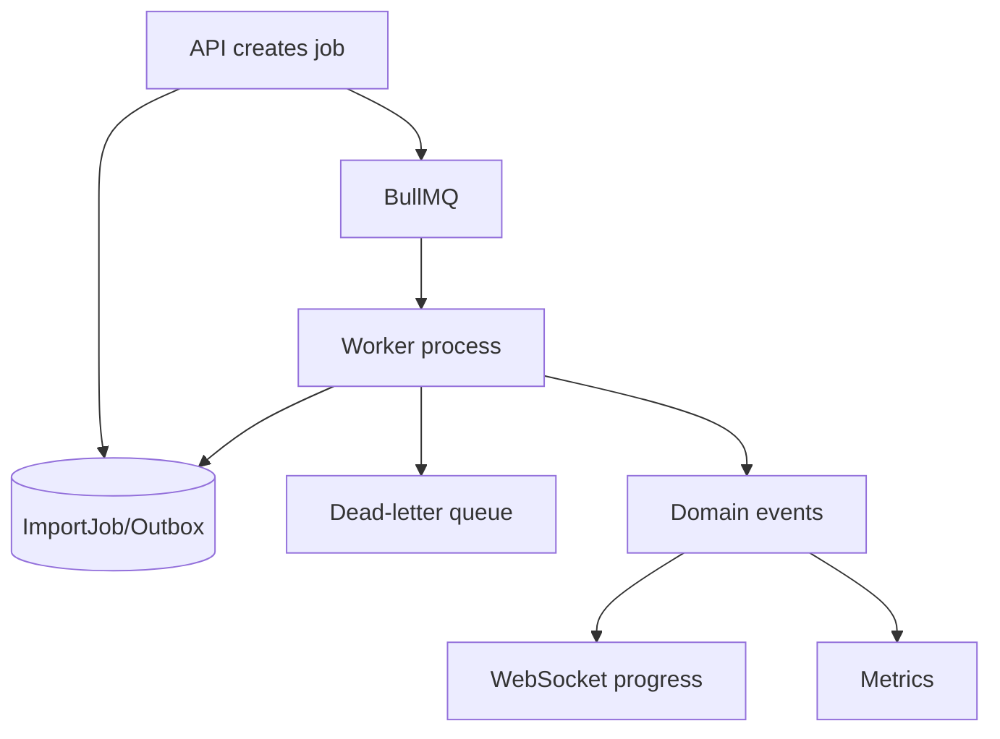
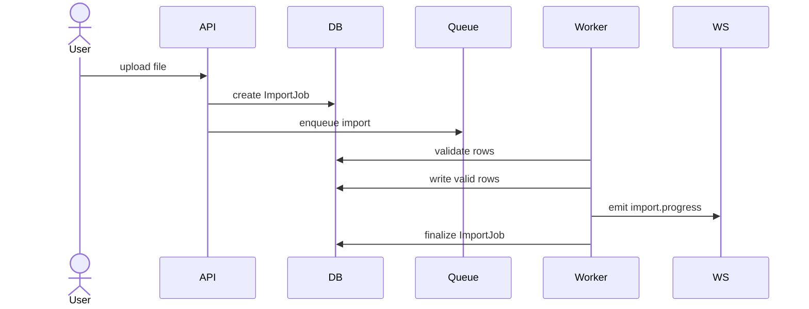

# Processamento Assincrono

Status: `IN_DESIGN`

## Escopo

BullMQ e Redis devem processar workloads lentos, retryable ou dependentes de sistemas externos:

- imports CSV/XLSX;
- geracao de relatorios;
- ingestao de tracking;
- geracao de insights;
- sincronizacao externa;
- fan-out de notificacoes.

## Arquitetura

## Proposta De Filas

| Queue | Proposito | Payload |
| --- | --- | --- |
| `imports` | Validar/processar arquivos enviados | `tenantId`, `actorId`, `importJobId`, `fileId`, `type`, `idempotencyKey`, `correlationId` |
| `tracking-ingestion` | Normalizar tracking externo/importado | `tenantId`, `source`, `externalEventId`, `shipmentRef`, `payloadRef` |
| `reports` | Gerar exports e relatorios | `tenantId`, `actorId`, `reportType`, `filters`, `idempotencyKey` |
| `insights` | Calcular insights deterministicos | `tenantId`, `period`, `ruleSetVersion` |
| `notifications` | Fan-out realtime/e-mail/webhook | `tenantId`, `eventType`, `resourceId`, `payloadRef` |

## Regras De Job

- Todo envelope de job deve incluir `tenantId`, `correlationId` e origem confiaveis.
- Chaves de idempotencia sao obrigatorias para escritas externas ou reprocessadas.
- Politica de retry deve ser por tipo de job, nao apenas global.
- Jobs falhos vao para DLQ ou permanecem inspecionaveis com retencao.
- Cancelamento deve ser explicito para imports e relatorios.
- Workers devem ter health checks e metricas para profundidade de fila, jobs ativos, jobs falhos e latencia.

## Fluxo De Importacao

## Desenvolvimento Com Recursos Limitados

Para maquinas locais, mantenha um processo worker com baixa concorrencia. Use configuracoes explicitas de concorrencia por fila e evite stacks pesadas de observabilidade ate staging.
