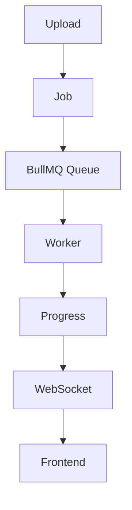

# Processamento Assincrono

Redis sustenta BullMQ. Payloads de jobs devem carregar contexto confiavel de tenant derivado da sessao autenticada e usar idempotencia ao processar arquivos ou simulacoes.
