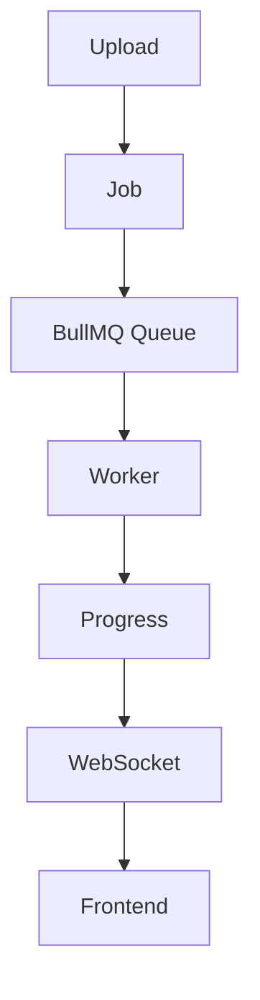

# Asynchronous Processing

```mermaid
flowchart TD
  Upload --> Job
  Job --> Queue[BullMQ Queue]
  Queue --> Worker
  Worker --> Progress
  Progress --> WebSocket
  WebSocket --> Frontend
```

Redis backs BullMQ. Job payloads must carry trusted tenant context from the authenticated session and use idempotency when processing files or simulations.
