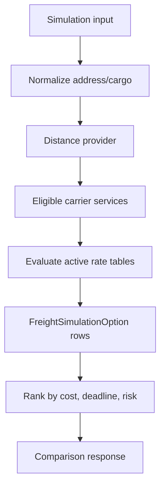

# Precificacao De Frete

Status: `IN_DESIGN`

## Problema

Precificacao de frete varia por transportadora, servico, origem, destino, faixa de peso, peso cubado, valor declarado da carga, impostos, seguro, frete minimo, pedagios e janela de vigencia. Um campo simples em `Carrier` nao modela isso com seguranca.

## Alternativas

| Opcao | Pros | Contras | Recomendacao |
| --- | --- | --- | --- |
| Tabelas relacionais normalizadas | Consultavel, auditavel, indexavel, bom para relatorios | Mais trabalho de schema | Recomendado para o core do MVP |
| Relacional hibrido + JSON validado | Lida com breakdown especifico de provider | JSON pode esconder regras se usado em excesso | Usar somente para metadata/breakdown |
| Regras somente em JSON | Flexivel no inicio | Dificil de validar, comparar, indexar, migrar e auditar | Rejeitar para MVP |
| Strategy somente em codigo | Testavel para regras fixas | Mudancas de negocio exigem deploy | Usar para servicos de calculo, nao como armazenamento |
| Rules engine | Poderoso para politicas complexas | Pesado, dificil de explicar, prematuro | Adiar |

## MVP Recomendado

Use tabelas de tarifas relacionais e versionadas:

- `FreightRateTable`: tenant, carrier service, versao, status, vigencia, origem/import job.
- `FreightRateLane`: escopo de origem/destino, regiao ou faixa de CEP.
- `FreightRateWeightBand`: peso cobrado minimo/maximo.
- `FreightRateFee`: valor minimo, taxa fixa, preco por kg, ad valorem, GRIS, pedagio, seguro.

Permita um JSON `breakdown` validado nos resultados de option da simulacao para preservar como o preco foi produzido. Nao armazene regras ativas de precificacao como JSON arbitrario.

## Fluxo De Simulacao

## Regras Principais

- Peso cobrado e o maior valor entre peso real e peso volumetrico.
- Persistir snapshot de entrada e versao de regra usada.
- Resultado de simulacao expira quando a vigencia da tarifa termina ou quando o TTL configurado passa.
- Uma opcao selecionada pode criar um shipment, mas uma simulacao pode permanecer apenas historica.
- Use Decimal para dinheiro, pesos, dimensoes, percentuais e distancia.

## APIs Externas

Integracoes iniciais recomendadas:

1. ViaCEP ou BrasilAPI para enriquecimento de CEP/endereco no Brasil.
2. OpenRouteService para estimativa de distancia e rota.

Use timeouts, retries com backoff, cache por tenant, fallback para entrada manual de distancia e mocks em testes.

## Testes

- peso cubado;
- frete minimo;
- ad valorem/GRIS;
- janela de vigencia;
- transportadora/servico/tabela inativa;
- fallback de API externa indisponivel;
- isolamento de tenant;
- mapeamento de opcao selecionada para shipment.
