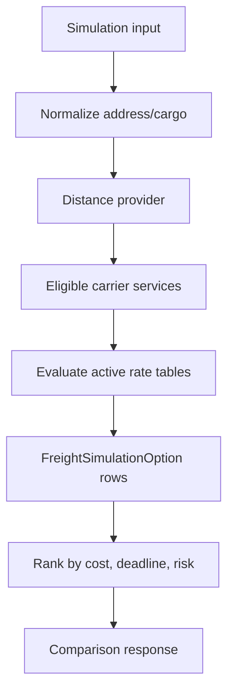

# Freight Pricing

Status: `IN_DESIGN`

## Problem

Freight pricing varies by carrier, service, origin, destination, weight range, cubed weight, declared cargo value, taxes, insurance, minimum freight, tolls, and validity window. A simple field on `Carrier` cannot model this safely.

## Alternatives

| Option | Pros | Cons | Recommendation |
| --- | --- | --- | --- |
| Relational normalized tables | Queryable, auditable, indexable, good for reports | More schema work | Recommended for MVP core |
| Hybrid relational + validated JSON | Handles provider-specific fee breakdown | JSON can hide rules if overused | Use only for metadata/breakdown |
| JSON-only rules | Flexible at first | Hard to validate, compare, index, migrate, and audit | Reject for MVP |
| Strategy code-only | Testable for fixed rules | Business changes require deploy | Use for calculation services, not as storage |
| Rules engine | Powerful for complex policies | Heavy, hard to explain, premature | Defer |

## Recommended MVP

Use versioned relational rate tables:

- `FreightRateTable`: tenant, carrier service, version, status, validity, source/import job.
- `FreightRateLane`: origin/destination scope, region or postal code range.
- `FreightRateWeightBand`: min/max chargeable weight.
- `FreightRateFee`: minimum amount, fixed fee, price per kg, ad valorem, GRIS, toll, insurance.

Allow a validated JSON `breakdown` on simulation option results to preserve how a price was produced. Do not store active pricing rules as arbitrary JSON.

## Simulation Flow

## Key Rules

- Chargeable weight is max of real weight and volumetric weight.
- Persist input snapshot and rule version used.
- A simulation result expires when rate validity ends or configured TTL passes.
- A selected option can create a shipment, but a simulation may remain only historical.
- Use Decimal for all money, weights, dimensions, percentages, and distance.

## External APIs

Recommended first integrations:

1. ViaCEP or BrasilAPI for Brazilian postal code/address enrichment.
2. OpenRouteService for distance and route estimation.

Use timeouts, retries with backoff, per-tenant cache, fallback to manual distance input, and mocks in tests.

## Tests

- cubed weight;
- minimum freight;
- ad valorem/GRIS;
- validity window;
- inactive carrier/service/rate table;
- unavailable external API fallback;
- tenant isolation;
- selected option to shipment mapping.
