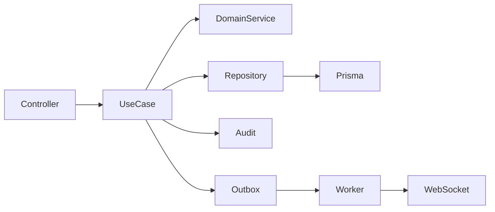

# Module Boundaries

Status: `IN_DESIGN`

## Recommended Modules

| Module | Responsibility | Entities | Allowed Dependencies | Forbidden Dependencies | Events |
| --- | --- | --- | --- | --- | --- |
| Identity and Access | login, OAuth, MFA, sessions, refresh rotation, permissions | User, RefreshToken, future Session/MfaSecret | Tenancy, Audit, Notifications | Business modules | `auth.login`, `auth.logout`, `session.revoked` |
| Tenancy | tenant lifecycle, branch scope, tenant settings | Tenant, Branch | Audit | Business feature internals | `tenant.created`, `tenant.suspended` |
| Users | tenant user management | User, Branch | Identity, Audit | Freight/Shipment internals | `user.invited`, `user.role_changed` |
| Customers | customer and address catalog | Customer, CustomerAddress | Audit, Integrations address lookup | Shipment writes except through use cases | `customer.created`, `customer.updated` |
| Carriers | carriers and services | Carrier, CarrierService | Audit, Integrations | Pricing internals | `carrier.updated`, `carrier_service.changed` |
| Freight Pricing | rate tables and calculation rules | FreightRateTable, rate rows | Carriers, Audit | Shipments writes | `rate_table.published` |
| Freight Simulation | simulation input and options | FreightSimulation, FreightSimulationOption | Customers, Carriers, Pricing, Integrations | Tracking internals | `simulation.created`, `simulation.calculated` |
| Shipments | real transport operation | Shipment, ShipmentAddress, ShipmentPackage | Customers, Carriers, Simulation, Audit | Dashboard writes | `shipment.created`, `shipment.updated` |
| Tracking | immutable logistics events and status machine | TrackingEvent, Shipment status | Shipments, Audit, Notifications | Pricing internals | `tracking.event_created`, `shipment.status_changed` |
| Imports | file upload, validation, async processing | ImportJob, ImportJobRow | Target modules through explicit import use cases | Direct bulk DB mutation bypassing validation | `import.progress`, `import.completed` |
| Dashboard | tenant-scoped aggregations | projections/read models | All read repositories | Mutating business state | `dashboard.updated` |
| Insights | rule-based recommendations | Insight | Dashboard, Shipments, Simulations | Direct external AI with sensitive data | `insight.created`, `insight.dismissed` |
| Audit | append-only accountability | AuditLog | Identity context | Business decision ownership | none or `audit.recorded` |
| Notifications | real-time and later email/webhook messages | Notification records future | Identity, Realtime adapter | Direct DB changes in other modules | `notification.sent` |
| Integrations | external APIs and webhook clients | IntegrationAccount future | Tenancy, Audit | UI/session state | provider-specific events |
| Observability | logs, metrics, traces, health | technical telemetry | all modules emit metadata | business state mutation | technical signals |

## Internal Flow

## Rules

- Controllers validate transport concerns and call one explicit use case.
- Use cases own authorization decisions near the business action.
- Repositories own Prisma access and must require tenant context for tenant-scoped data.
- Domain services are introduced only for reusable rules, such as shipment state transitions or freight pricing.
- No base repository until at least three modules prove identical, non-trivial persistence behavior.
- No module should read another module's tables directly when a use case or repository boundary is needed for invariants.

## Testing Boundary

Each module must ship with:

- unit tests for rules;
- integration tests for repository tenant filters;
- e2e tests for public contracts;
- authorization tests;
- audit assertion for sensitive mutations;
- concurrency/idempotency tests where applicable.

## API Contracts Proposal

All private endpoints require authenticated tenant context unless marked public. Pagination uses `page/perPage` for MVP and may move to cursor for high-volume tracking.

| Module | Endpoint | Method | Function | Auth | Role | Tenant | Audit | Idempotency | Pagination/Filters | Main Errors |
| --- | --- | --- | --- | --- | --- | --- | --- | --- | --- | --- |
| Auth | `/api/v1/auth/login` | POST | authenticate email/password | Public | none | resolved from identity | login/failure | optional client key | none | invalid credentials, MFA required, rate limited |
| Auth | `/api/v1/auth/mfa/verify` | POST | verify TOTP challenge | Public with challenge | none | resolved from challenge | MFA success/failure | challenge id | none | invalid code, expired |
| Auth | `/api/v1/auth/refresh` | POST | rotate refresh token | Cookie | user | from session | refresh reuse/revocation | token family | none | revoked, expired |
| Auth | `/api/v1/auth/logout` | POST | revoke current session | Private | user | from session | logout | none | none | unauthorized |
| Users | `/api/v1/users/invitations` | POST | invite user | Private | ADMIN | required | user invited | `Idempotency-Key` | none | duplicate, forbidden |
| Users | `/api/v1/users` | GET | list tenant users | Private | ADMIN/MANAGER | required | no | none | status, role, branch, search | forbidden |
| Users | `/api/v1/users/{id}/role` | PATCH | change role | Private | ADMIN | required | role changed | none | none | invalid role, forbidden |
| Tenants | `/api/v1/tenants/current` | GET | current tenant summary | Private | user | required | no | none | none | tenant disabled |
| Branches | `/api/v1/branches` | GET | list branches | Private | ADMIN/MANAGER | required | no | none | active, search | forbidden |
| Customers | `/api/v1/customers` | POST | register customer | Private | ADMIN/MANAGER/OPERATOR* | required | customer created | `Idempotency-Key` | none | duplicate document, validation |
| Customers | `/api/v1/customers` | GET | search customers | Private | user | required | no | none | active, document, search | forbidden |
| Customers | `/api/v1/customers/{id}/addresses` | POST | add customer address | Private | ADMIN/MANAGER/OPERATOR* | required | address changed | optional | none | not found, validation |
| Carriers | `/api/v1/carriers` | POST | register carrier | Private | ADMIN/MANAGER | required | carrier created | `Idempotency-Key` | none | duplicate, validation |
| Carrier Services | `/api/v1/carrier-services` | POST | create carrier service | Private | ADMIN/MANAGER | required | service created | `Idempotency-Key` | none | inactive carrier, duplicate |
| Freight Pricing | `/api/v1/freight-rate-tables/{id}/publish` | POST | publish rate table version | Private | ADMIN/MANAGER | required | rate published | none | none | overlap, invalid state |
| Freight Simulation | `/api/v1/freight-simulations` | POST | create/calculate simulation | Private | user | required | simulation created | `Idempotency-Key` | none | no rate, provider unavailable |
| Freight Simulation | `/api/v1/freight-simulations/{id}/options/{optionId}/select` | POST | select option and optionally create shipment | Private | user | required | option selected | `Idempotency-Key` | none | expired option, invalid state |
| Shipments | `/api/v1/shipments` | POST | create manual shipment | Private | OPERATOR/MANAGER | required | shipment created | `Idempotency-Key` | none | invalid package/address |
| Shipments | `/api/v1/shipments` | GET | monitor shipments | Private | user | required | no | none | status, carrier, customer, ETA, period | forbidden |
| Tracking | `/api/v1/shipments/{id}/tracking-events` | POST | append tracking event | Private | OPERATOR/MANAGER | required | manual tracking action | `Idempotency-Key` | none | invalid transition, duplicate |
| Imports | `/api/v1/imports` | POST | create import job | Private | module-specific | required | import created | `Idempotency-Key` | type | invalid file/type |
| Imports | `/api/v1/imports/{id}` | GET | get import progress | Private | user | required | no | none | none | not found |
| Dashboard | `/api/v1/dashboard/summary` | GET | tenant KPI summary | Private | MANAGER/ADMIN | required | no | none | period, branch, carrier | invalid range |
| Insights | `/api/v1/insights` | GET | list active insights | Private | MANAGER/ADMIN | required | no | none | priority, status, period | stale projection |
| Insights | `/api/v1/insights/{id}/dismiss` | POST | dismiss insight | Private | MANAGER/ADMIN | required | insight dismissed | none | none | not found |
| Audit | `/api/v1/audit` | GET | query audit trail | Private | ADMIN | required | no | none | entity, actor, action, period | forbidden |

`OPERATOR*` means allowed only if the tenant policy approves operators creating operational records.
