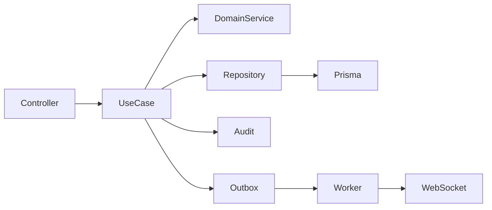

# Limites De Modulos

Status: `IN_DESIGN`

## Modulos Recomendados

| Modulo | Responsabilidade | Entidades | Dependencias Permitidas | Dependencias Proibidas | Eventos |
| --- | --- | --- | --- | --- | --- |
| Identity and Access | login, OAuth, MFA, sessoes, rotacao de refresh, permissoes | User, RefreshToken, futuros Session/MfaSecret | Tenancy, Audit, Notifications | Modulos de negocio | `auth.login`, `auth.logout`, `session.revoked` |
| Tenancy | ciclo de vida do tenant, escopo de filial, configuracoes do tenant | Tenant, Branch | Audit | Internos de funcionalidades de negocio | `tenant.created`, `tenant.suspended` |
| Users | gestao de usuarios do tenant | User, Branch | Identity, Audit | Internos de Freight/Shipment | `user.invited`, `user.role_changed` |
| Customers | catalogo de clientes e enderecos | Customer, CustomerAddress | Audit, Integrations address lookup | Escritas de Shipment exceto por use cases | `customer.created`, `customer.updated` |
| Carriers | transportadoras e servicos | Carrier, CarrierService | Audit, Integrations | Internos de Pricing | `carrier.updated`, `carrier_service.changed` |
| Freight Pricing | tabelas de frete e regras de calculo | FreightRateTable, rate rows | Carriers, Audit | Escritas de Shipments | `rate_table.published` |
| Freight Simulation | entradas e opcoes de simulacao | FreightSimulation, FreightSimulationOption | Customers, Carriers, Pricing, Integrations | Internos de Tracking | `simulation.created`, `simulation.calculated` |
| Shipments | operacao real de transporte | Shipment, ShipmentAddress, ShipmentPackage | Customers, Carriers, Simulation, Audit | Escritas de Dashboard | `shipment.created`, `shipment.updated` |
| Tracking | eventos logisticos imutaveis e maquina de status | TrackingEvent, Shipment status | Shipments, Audit, Notifications | Internos de Pricing | `tracking.event_created`, `shipment.status_changed` |
| Imports | upload de arquivo, validacao, processamento async | ImportJob, ImportJobRow | Modulos de destino por use cases explicitos de importacao | Mutation bulk direta no DB ignorando validacao | `import.progress`, `import.completed` |
| Dashboard | agregacoes tenant-scoped | projections/read models | Todos os repositorios de leitura | Alterar estado de negocio | `dashboard.updated` |
| Insights | recomendacoes baseadas em regras | Insight | Dashboard, Shipments, Simulations | IA externa direta com dados sensiveis | `insight.created`, `insight.dismissed` |
| Audit | responsabilizacao append-only | AuditLog | Contexto de identidade | Ownership de decisao de negocio | nenhum ou `audit.recorded` |
| Notifications | realtime e futuras mensagens e-mail/webhook | registros futuros de Notification | Identity, adapter Realtime | Mudancas diretas no DB de outros modulos | `notification.sent` |
| Integrations | APIs externas e clientes webhook | IntegrationAccount futuro | Tenancy, Audit | Estado de UI/sessao | eventos especificos do provider |
| Observability | logs, metricas, traces, health | telemetria tecnica | todos os modulos emitem metadata | mutation de estado de negocio | sinais tecnicos |

## Fluxo Interno

## Regras

- Controllers validam preocupacoes de transporte e chamam um use case explicito.
- Use cases possuem as decisoes de autorizacao proximas da acao de negocio.
- Repositories possuem acesso Prisma e devem exigir contexto de tenant para dados tenant-scoped.
- Domain services sao introduzidos somente para regras reutilizaveis, como transicoes de status de shipment ou precificacao de frete.
- Nenhum base repository ate ao menos tres modulos provarem comportamento de persistencia identico e nao trivial.
- Nenhum modulo deve ler tabelas de outro modulo diretamente quando um limite por use case ou repository for necessario para preservar invariantes.

## Limite De Testes

Cada modulo deve entregar:

- testes unitarios para regras;
- testes de integracao para filtros de tenant em repositories;
- testes e2e para contratos publicos;
- testes de autorizacao;
- assercao de auditoria para mutations sensiveis;
- testes de concorrencia/idempotencia quando aplicavel.

## Proposta De Contratos De API

Todos os endpoints privados exigem contexto autenticado de tenant, exceto quando marcados como publicos. Paginacao usa `page/perPage` para o MVP e pode migrar para cursor em tracking de alto volume.

| Modulo | Endpoint | Metodo | Funcao | Auth | Role | Tenant | Auditoria | Idempotencia | Paginacao/Filtros | Erros Principais |
| --- | --- | --- | --- | --- | --- | --- | --- | --- | --- | --- |
| Auth | `/api/v1/auth/login` | POST | autenticar e-mail/senha | Public | nenhum | resolvido pela identidade | login/failure | chave client opcional | nenhum | credenciais invalidas, MFA required, rate limited |
| Auth | `/api/v1/auth/mfa/verify` | POST | verificar desafio TOTP | Public com challenge | nenhum | resolvido pelo challenge | MFA success/failure | challenge id | nenhum | codigo invalido, expirado |
| Auth | `/api/v1/auth/refresh` | POST | rotacionar refresh token | Cookie | user | da sessao | refresh reuse/revocation | token family | nenhum | revogado, expirado |
| Auth | `/api/v1/auth/logout` | POST | revogar sessao atual | Private | user | da sessao | logout | nenhum | nenhum | unauthorized |
| Users | `/api/v1/users/invitations` | POST | convidar usuario | Private | ADMIN | obrigatorio | user invited | `Idempotency-Key` | nenhum | duplicado, forbidden |
| Users | `/api/v1/users` | GET | listar usuarios do tenant | Private | ADMIN/MANAGER | obrigatorio | nao | nenhum | status, role, branch, search | forbidden |
| Users | `/api/v1/users/{id}/role` | PATCH | alterar role | Private | ADMIN | obrigatorio | role changed | nenhum | nenhum | invalid role, forbidden |
| Tenants | `/api/v1/tenants/current` | GET | resumo do tenant atual | Private | user | obrigatorio | nao | nenhum | nenhum | tenant disabled |
| Branches | `/api/v1/branches` | GET | listar filiais | Private | ADMIN/MANAGER | obrigatorio | nao | nenhum | active, search | forbidden |
| Customers | `/api/v1/customers` | POST | cadastrar cliente | Private | ADMIN/MANAGER/OPERATOR* | obrigatorio | customer created | `Idempotency-Key` | nenhum | duplicate document, validation |
| Customers | `/api/v1/customers` | GET | buscar clientes | Private | user | obrigatorio | nao | nenhum | active, document, search | forbidden |
| Customers | `/api/v1/customers/{id}/addresses` | POST | adicionar endereco de cliente | Private | ADMIN/MANAGER/OPERATOR* | obrigatorio | address changed | opcional | nenhum | not found, validation |
| Carriers | `/api/v1/carriers` | POST | cadastrar transportadora | Private | ADMIN/MANAGER | obrigatorio | carrier created | `Idempotency-Key` | nenhum | duplicate, validation |
| Carrier Services | `/api/v1/carrier-services` | POST | criar servico de transportadora | Private | ADMIN/MANAGER | obrigatorio | service created | `Idempotency-Key` | nenhum | inactive carrier, duplicate |
| Freight Pricing | `/api/v1/freight-rate-tables/{id}/publish` | POST | publicar versao de tabela de frete | Private | ADMIN/MANAGER | obrigatorio | rate published | nenhum | nenhum | overlap, invalid state |
| Freight Simulation | `/api/v1/freight-simulations` | POST | criar/calcular simulacao | Private | user | obrigatorio | simulation created | `Idempotency-Key` | nenhum | no rate, provider unavailable |
| Freight Simulation | `/api/v1/freight-simulations/{id}/options/{optionId}/select` | POST | selecionar opcao e opcionalmente criar shipment | Private | user | obrigatorio | option selected | `Idempotency-Key` | nenhum | expired option, invalid state |
| Shipments | `/api/v1/shipments` | POST | criar shipment manual | Private | OPERATOR/MANAGER | obrigatorio | shipment created | `Idempotency-Key` | nenhum | invalid package/address |
| Shipments | `/api/v1/shipments` | GET | monitorar shipments | Private | user | obrigatorio | nao | nenhum | status, carrier, customer, ETA, period | forbidden |
| Tracking | `/api/v1/shipments/{id}/tracking-events` | POST | anexar evento de tracking | Private | OPERATOR/MANAGER | obrigatorio | manual tracking action | `Idempotency-Key` | nenhum | invalid transition, duplicate |
| Imports | `/api/v1/imports` | POST | criar import job | Private | module-specific | obrigatorio | import created | `Idempotency-Key` | type | invalid file/type |
| Imports | `/api/v1/imports/{id}` | GET | obter progresso de importacao | Private | user | obrigatorio | nao | nenhum | nenhum | not found |
| Dashboard | `/api/v1/dashboard/summary` | GET | resumo de KPI do tenant | Private | MANAGER/ADMIN | obrigatorio | nao | nenhum | period, branch, carrier | invalid range |
| Insights | `/api/v1/insights` | GET | listar insights ativos | Private | MANAGER/ADMIN | obrigatorio | nao | nenhum | priority, status, period | stale projection |
| Insights | `/api/v1/insights/{id}/dismiss` | POST | dispensar insight | Private | MANAGER/ADMIN | obrigatorio | insight dismissed | nenhum | nenhum | not found |
| Audit | `/api/v1/audit` | GET | consultar trilha de auditoria | Private | ADMIN | obrigatorio | nao | nenhum | entity, actor, action, period | forbidden |

`OPERATOR*` significa permitido somente se a politica do tenant aprovar operadores criando registros operacionais.
