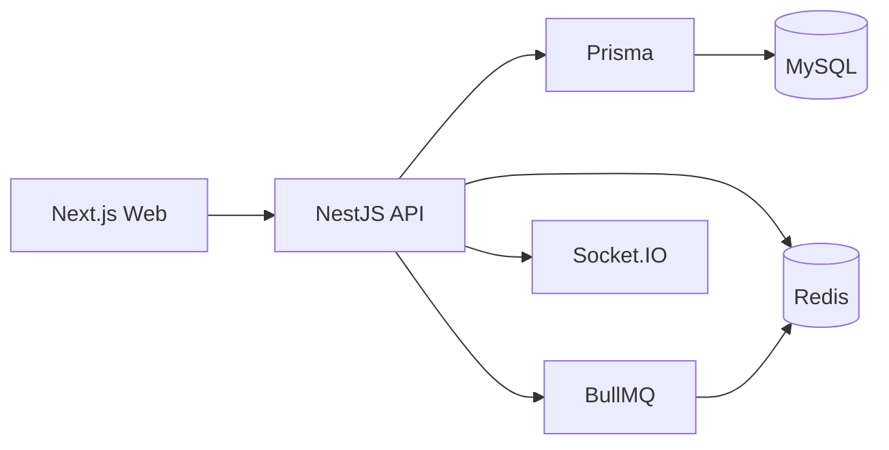

# Architecture Overview

```mermaid
flowchart LR
  Web[Next.js Web] --> API[NestJS API]
  API --> Prisma[Prisma]
  Prisma --> MySQL[(MySQL)]
  API --> Redis[(Redis)]
  API --> Queue[BullMQ]
  Queue --> Redis
  API --> Socket[Socket.IO]
```

The frontend consumes only the API. Prisma and database credentials remain server-side in `apps/api`.
