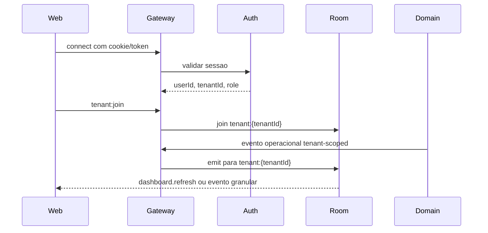

# Realtime

Status: implementado para infraestrutura autenticada e fluxos de refresh tenant-scoped, com evolucao prevista para eventos mais granulares de tracking/imports.

## Objetivo

Fornecer atualizacoes em tempo real para telas operacionais sem permitir que o cliente escolha tenant arbitrariamente.

## Tecnologia

- Socket.IO no backend NestJS.
- `socket.io-client` no frontend.
- Redis como infraestrutura compartilhada do ambiente e base para escalar realtime/filas.

Codigo principal:

- Backend: `apps/api/src/infrastructure/realtime/notifications.gateway.ts`
- Modulo: `apps/api/src/modules/notifications/notifications.module.ts`
- Frontend: uso de Socket.IO em telas como dashboard.
- Teste: `apps/api/src/infrastructure/realtime/notifications.gateway.spec.ts`

## Autenticacao e isolamento

1. O cliente conecta usando cookie/token da sessao autenticada.
2. O backend resolve `userId`, `tenantId` e `role` a partir do contexto autenticado.
3. O cliente pode pedir entrada em sala operacional, mas nao informa tenant livremente.
4. A sala base e derivada do tenant autenticado.

Padrao de sala:

```text
tenant:{tenantId}
tenant:{tenantId}:user:{userId}
```

Regra obrigatoria:

- nenhuma mensagem deve usar `tenantId` vindo do corpo enviado pelo navegador como fonte de autorizacao.

## Eventos atuais

| Evento | Direcao | Uso |
| --- | --- | --- |
| `tenant:join` | cliente -> servidor | Solicita entrada na sala do tenant autenticado. |
| `dashboard.refresh` | servidor -> cliente | Invalida/atualiza consultas do dashboard quando dados relevantes mudam. |

## Eventos recomendados por dominio

Os eventos abaixo sao a nomenclatura recomendada para evolucao dos fluxos granulares:

| Evento | Direcao | Payload minimo |
| --- | --- | --- |
| `shipment.updated.v1` | servidor -> cliente | `shipmentId`, `version`, `currentStatus`, `currentStatusAt` |
| `tracking.event_created.v1` | servidor -> cliente | `shipmentId`, `trackingEventId`, `occurredAt`, `eventType` |
| `import.progress.v1` | servidor -> cliente | `importJobId`, `status`, `processedRows`, `totalRows`, `errorCount` |
| `import.completed.v1` | servidor -> cliente | `importJobId`, `status`, `summary` |
| `dashboard.updated.v1` | servidor -> cliente | `period`, `affectedKpis` |
| `insight.generated.v1` | servidor -> cliente | `insightId`, `severity`, `category` |

O payload nao precisa repetir `tenantId` para autorizacao do cliente. O tenant vem da sala autenticada e dos dados persistidos.

## Fluxo



## Relacao com processamento assincrono

Imports CSV/XLSX usam BullMQ/Redis. O worker pode emitir progresso por realtime depois de atualizar `ImportJob`/`ImportRowResult`.

Regras:

- persistir estado antes de emitir evento;
- eventos realtime sao notificacao, nao fonte primaria de verdade;
- frontend deve manter polling/refetch como fallback;
- eventos devem carregar identificador de recurso e versao/timestamp.

## Seguranca

- Validar origem com a mesma allowlist de CORS HTTP.
- Rejeitar conexoes sem sessao valida.
- Nao aceitar tenant livre no payload do cliente.
- Nao enviar segredos, tokens, hashes, linhas completas de importacao ou PII desnecessaria.
- Desconectar ou negar join quando usuario/tenant estiver inativo.

## Observabilidade

Registrar:

- conexoes aceitas/recusadas;
- falha de autenticacao no handshake;
- joins por tenant;
- eventos emitidos por tipo;
- erros de entrega;
- desconexoes anormais.

Campos esperados:

- `request_id` ou `correlation_id` quando disponivel;
- `tenant_id`;
- `user_id`;
- `event`;
- `resource_type`;
- `resource_id`.

## Testes minimos

- conexao sem sessao nao entra em sala privada;
- `tenant:join` entra somente na sala do tenant autenticado;
- tenant A nao recebe evento de tenant B;
- dashboard invalida queries quando recebe evento de refresh;
- imports/tracking mantem fallback por HTTP quando socket desconecta.
