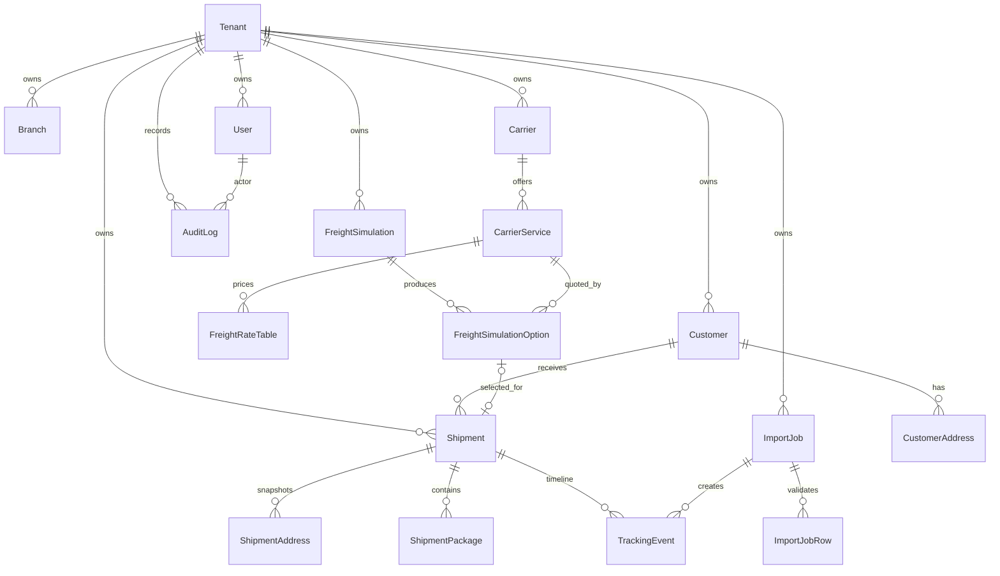
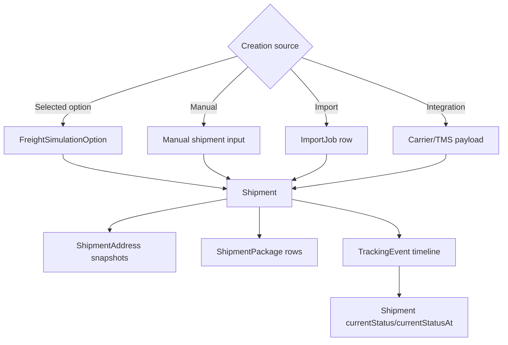
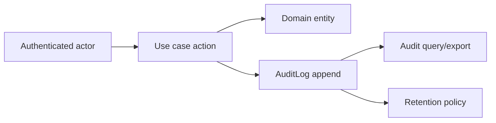

# Recommended Domain Model

Status: `IN_DESIGN`

## Entity Map

## Entity Recommendations

### Tenant

Tenant is the contracting company. Keep shared database/shared schema with `tenantId` on private business tables. Future dedicated environments may be handled by deployment routing, not by changing domain contracts.

### Branch

Branch is optional in the MVP. Do not force `branchId` onto every table until workflows require branch-scoped permissions, reports, or ownership.

### Customer and CustomerAddress

Customer should support individual/company identity without overmodeling on day one. Recommended fields: `tenantId`, `type`, `name`, `legalName`, `document`, contacts, status, timestamps, optional `deletedAt`.

CustomerAddress should be a reusable address catalog. It must not serve as the historical address for a shipment.

### Carrier and CarrierService

Carrier identifies the tenant's transport provider. CarrierService represents modes such as economic, express, same day, less-than-truckload, or road freight.

Service-specific constraints, cubing factor, minimum freight, SLA, active regions, and integration mapping belong to CarrierService or FreightRateTable, not directly to Carrier.

### FreightRateTable

Use a versioned pricing aggregate. For MVP, prefer relational tables for tariff dimensions and limited validated JSON only for output breakdowns or provider-specific metadata.

### FreightSimulation and FreightSimulationOption

FreightSimulation is an estimate request. It may reference customer/branch and stores route/cargo inputs. FreightSimulationOption stores individual carrier service alternatives. A shipment may be created from one selected option.

### Shipment

Shipment is the operational transport record. It may come from a selected simulation option, manual entry, import, or external integration. Optional relationships should be explicit because not every shipment has a customer or simulation.

### TrackingEvent

TrackingEvent is immutable and tenant-scoped. It may change current shipment status, update ETA, add a note, register location, or correct a previous event.

### ImportJob

ImportJob should be typed by import purpose. Avoid a generic importer that accepts arbitrary schemas. Each import type needs mapping, validation, row-level error reports, and idempotency.

### AuditLog

AuditLog is append-only system accountability. It records actor, action, entity, request, IP hash, user agent, before/after snapshots when safe, result, and error classification.

## Aggregate Boundaries

- Customer aggregate: `Customer`, `CustomerAddress`.
- Carrier aggregate: `Carrier`, `CarrierService`.
- Freight pricing aggregate: `FreightRateTable`, rate rows/version data.
- Freight simulation aggregate: `FreightSimulation`, `FreightSimulationOption`.
- Shipment aggregate: `Shipment`, `ShipmentAddress`, `ShipmentPackage`, `TrackingEvent`.
- Import aggregate: `ImportJob`, `ImportJobRow`, generated domain records.
- Audit is append-only and should not be mutated by domain aggregates.

## Shipment Lifecycle Diagram

## Audit Diagram

