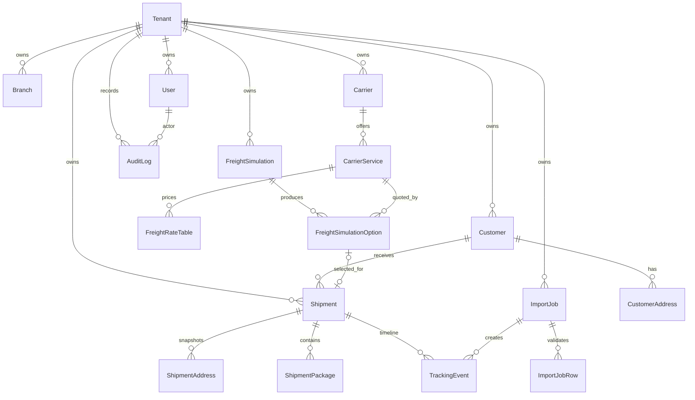
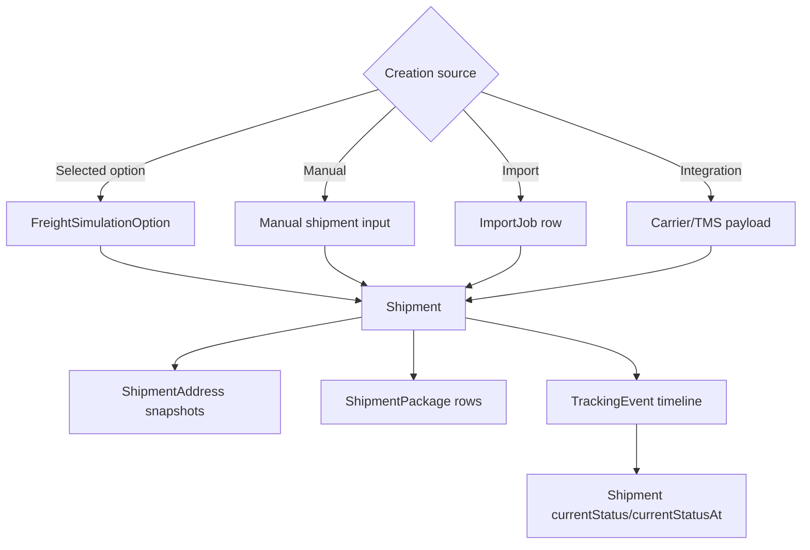
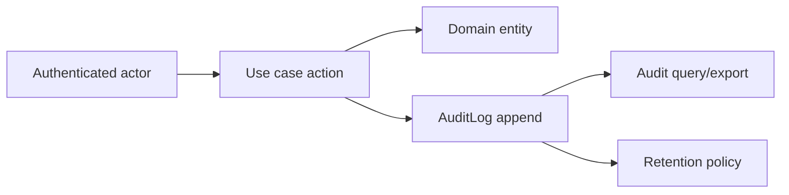

# Modelo De Dominio Recomendado

Status: `IN_DESIGN`

## Mapa De Entidades

## Recomendacoes De Entidades

### Tenant

Tenant e a empresa contratante. Mantenha banco compartilhado/schema compartilhado com `tenantId` nas tabelas privadas de negocio. Ambientes dedicados futuros podem ser tratados por roteamento de deploy, nao por mudanca de contratos de dominio.

### Branch

Branch e opcional no MVP. Nao force `branchId` em toda tabela ate que os workflows exijam permissoes, relatorios ou ownership por filial.

### Customer E CustomerAddress

Customer deve suportar identidade pessoa fisica/juridica sem modelagem excessiva no primeiro dia. Campos recomendados: `tenantId`, `type`, `name`, `legalName`, `document`, contatos, status, timestamps e `deletedAt` opcional.

CustomerAddress deve ser um catalogo reutilizavel de enderecos. Ele nao deve servir como endereco historico de um shipment.

### Carrier E CarrierService

Carrier identifica o provedor de transporte do tenant. CarrierService representa modalidades como economico, expresso, same day, less-than-truckload ou frete rodoviario.

Restricoes especificas de servico, fator de cubagem, frete minimo, SLA, regioes ativas e mapeamento de integracao pertencem a CarrierService ou FreightRateTable, nao diretamente a Carrier.

### FreightRateTable

Use um agregado de precificacao versionado. Para o MVP, prefira tabelas relacionais para dimensoes tarifarias e JSON limitado/validado somente para breakdowns de saida ou metadata especifica de provedor.

### FreightSimulation E FreightSimulationOption

FreightSimulation e uma requisicao de estimativa. Ela pode referenciar customer/branch e armazena entradas de rota/carga. FreightSimulationOption armazena alternativas individuais por servico de transportadora. Um shipment pode ser criado a partir de uma opcao selecionada.

### Shipment

Shipment e o registro operacional de transporte. Pode vir de uma opcao selecionada de simulacao, entrada manual, importacao ou integracao externa. Relacionamentos opcionais devem ser explicitos porque nem todo shipment possui cliente ou simulacao.

### TrackingEvent

TrackingEvent e imutavel e tenant-scoped. Ele pode alterar o status atual do shipment, atualizar ETA, adicionar nota, registrar localizacao ou corrigir evento anterior.

### ImportJob

ImportJob deve ser tipado por finalidade de importacao. Evite importador generico que aceita schemas arbitrarios. Cada tipo de importacao precisa de mapeamento, validacao, relatorios de erro por linha e idempotencia.

### AuditLog

AuditLog e responsabilizacao append-only do sistema. Registra ator, acao, entidade, requisicao, hash de IP, user agent, snapshots before/after quando seguro, resultado e classificacao de erro.

## Limites De Agregado

- Agregado Customer: `Customer`, `CustomerAddress`.
- Agregado Carrier: `Carrier`, `CarrierService`.
- Agregado de precificacao de frete: `FreightRateTable`, rate rows/version data.
- Agregado de simulacao de frete: `FreightSimulation`, `FreightSimulationOption`.
- Agregado Shipment: `Shipment`, `ShipmentAddress`, `ShipmentPackage`, `TrackingEvent`.
- Agregado Import: `ImportJob`, `ImportJobRow`, registros de dominio gerados.
- Audit e append-only e nao deve ser alterado por agregados de dominio.

## Diagrama De Ciclo De Vida Do Shipment

## Diagrama De Auditoria

