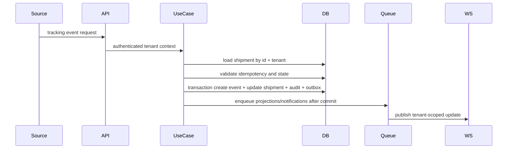
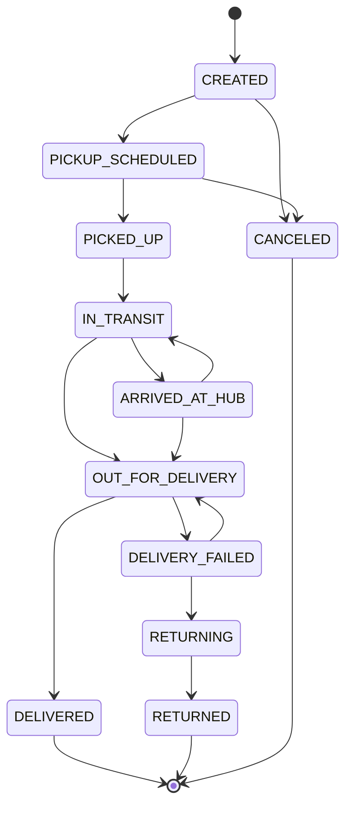

# Arquitetura De Tracking

Status: `IN_DESIGN`

## Proposito

Tracking registra fatos logisticos de um shipment. Ele nao e o mesmo que auditoria. Um evento de tracking pode ser importado, manual, externo, dirigido por webhook ou gerado pelo sistema.

## Fluxo De Evento

## Etapas Obrigatorias

1. autenticar ator ou integracao;
2. resolver tenant a partir de contexto confiavel;
3. autorizar a acao sobre o recurso;
4. encontrar shipment por `id + tenantId`;
5. validar origem e identidade externa;
6. verificar idempotencia;
7. validar tipo de evento;
8. validar transicao de status quando presente;
9. tratar eventos fora de ordem;
10. criar `TrackingEvent` imutavel;
11. atualizar `Shipment.currentStatus` e `currentStatusAt` quando aplicavel;
12. commitar em uma transacao;
13. gravar auditoria para acao manual/sistemica;
14. publicar evento de dominio;
15. notificar salas WebSocket;
16. invalidar cache tenant-scoped;
17. atualizar metricas/projecoes;
18. retornar resposta segura.

## Maquina De Status

## Regras De Status

- Status terminais: `DELIVERED`, `RETURNED`, `CANCELED`.
- Transicoes administrativas podem reabrir status terminal somente por evento de correcao com permissao elevada e auditoria.
- Eventos sem status: `ETA_UPDATED`, `LOCATION_UPDATED`, `NOTE_ADDED`, `EXCEPTION_REPORTED`, salvo quando explicitamente mapeados para um status.
- Eventos fora de ordem sao armazenados, mas o status atual muda somente se o evento puder sobrescrever `currentStatusAt`.
- Correcoes nunca alteram eventos originais; `correctsEventId` aponta para o evento corrigido.

## Idempotencia

- Eventos externos: unicidade por `(tenantId, source, externalEventId)`.
- Eventos manuais: `Idempotency-Key` opcional para clientes seguros contra retry.
- Imports: idempotencia por `(tenantId, importJobId, rowNumber, normalizedHash)` ou ID externo de origem.

## Concorrencia

Use uma transacao para inserir evento e atualizar shipment. Adicione concorrencia otimista com campo `version` em shipment antes de ingestao de tracking de alto volume. Para integracoes com entrega at-least-once, aplique retry em deadlocks e conflitos de idempotencia.

## Testes

- evento valido;
- transicao invalida;
- evento externo duplicado;
- evento fora de ordem;
- protecao de status terminal;
- evento de correcao;
- evento sem mudanca de status;
- tenant errado;
- usuario nao autorizado;
- atualizacao atomica de evento/status;
- notificacao WebSocket;
- escrita de auditoria.
