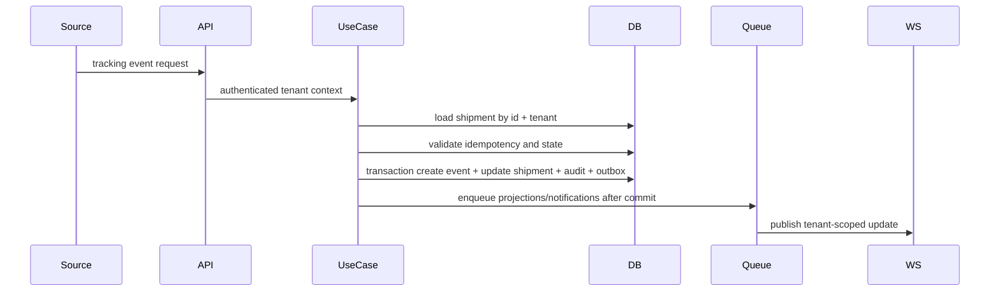
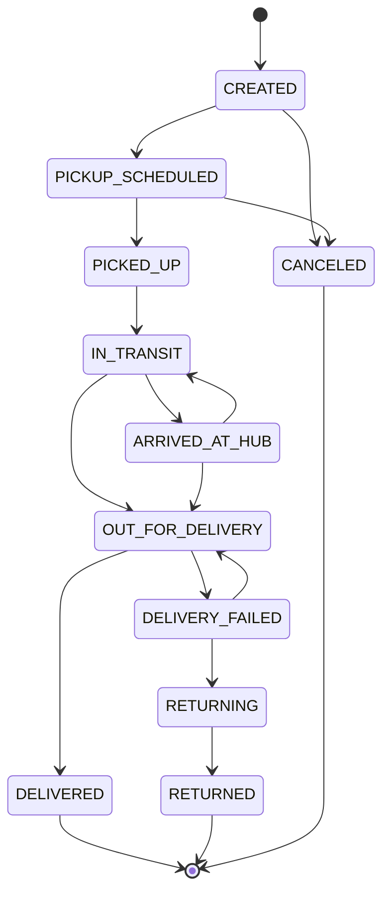

# Tracking Architecture

Status: `IN_DESIGN`

## Purpose

Tracking records logistics facts for a shipment. It is not the same as audit. A tracking event can be imported, manual, external, webhook-driven, or system-generated.

## Event Flow

## Required Steps

1. authenticate actor or integration;
2. resolve tenant from trusted context;
3. authorize resource action;
4. find shipment by `id + tenantId`;
5. validate source and external identity;
6. check idempotency;
7. validate event type;
8. validate status transition when present;
9. handle out-of-order events;
10. create immutable `TrackingEvent`;
11. update `Shipment.currentStatus` and `currentStatusAt` if applicable;
12. commit in one transaction;
13. write audit for manual/system action;
14. publish domain event;
15. notify WebSocket rooms;
16. invalidate tenant-scoped cache;
17. update metrics/projections;
18. return safe response.

## Status Machine

## Status Rules

- Terminal statuses: `DELIVERED`, `RETURNED`, `CANCELED`.
- Administrative transitions may reopen terminal status only through a correction event with elevated permission and audit.
- Non-status events: `ETA_UPDATED`, `LOCATION_UPDATED`, `NOTE_ADDED`, `EXCEPTION_REPORTED` unless explicitly mapped to a status.
- Out-of-order events are stored, but current status changes only if the event is allowed to supersede `currentStatusAt`.
- Corrections never mutate original events; `correctsEventId` points to the corrected event.

## Idempotency

- External events: unique `(tenantId, source, externalEventId)`.
- Manual events: optional `Idempotency-Key` for retry-safe clients.
- Imports: idempotency from `(tenantId, importJobId, rowNumber, normalizedHash)` or source external ID.

## Concurrency

Use a transaction for event insert and shipment update. Add optimistic concurrency with a shipment `version` field before high-volume tracking ingestion. For integrations with at-least-once delivery, retry on deadlocks and idempotency conflicts.

## Tests

- valid event;
- invalid transition;
- duplicate external event;
- out-of-order event;
- terminal status guard;
- correction event;
- event without status change;
- wrong tenant;
- unauthorized user;
- atomic event/status update;
- WebSocket notification;
- audit write.
