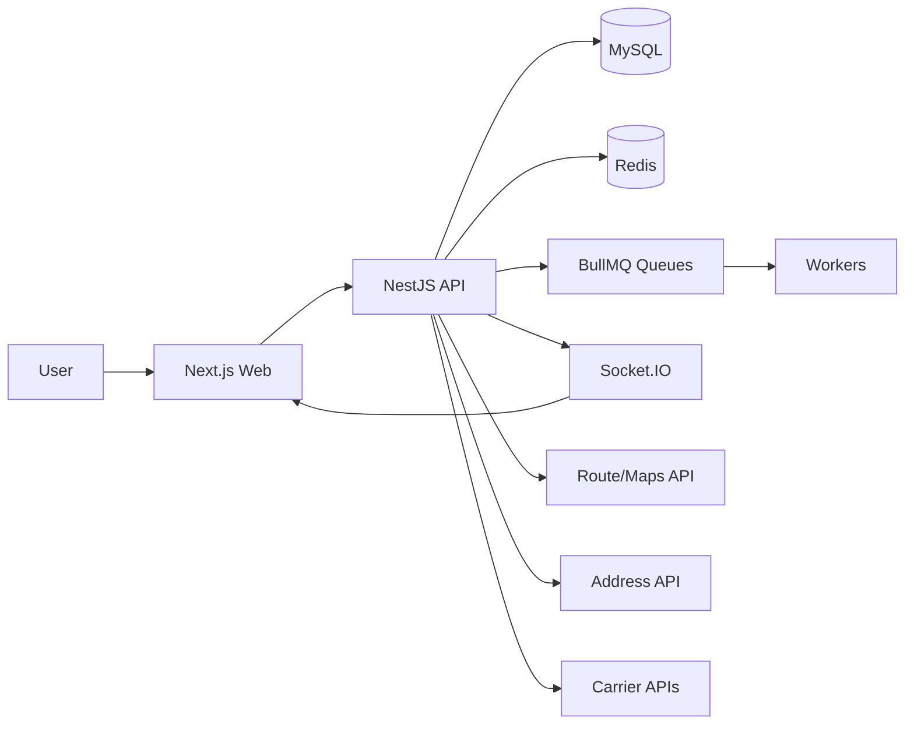
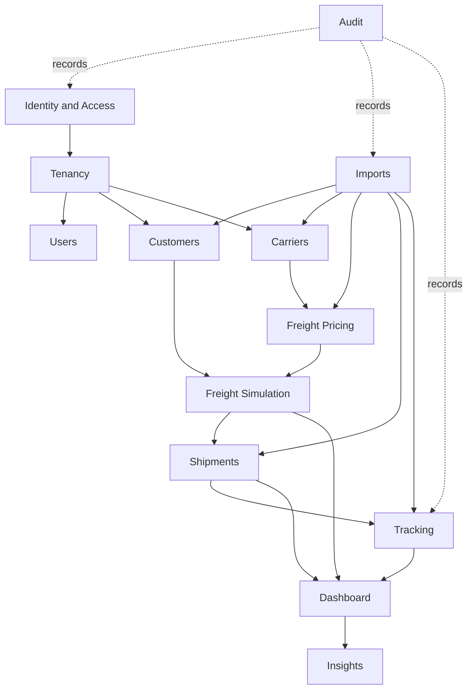

# Domain Definition

Status: `IN_DESIGN`

## Product Positioning

The platform is a multi-tenant logistics intelligence SaaS for freight cost control, carrier comparison, shipment execution monitoring, tracking event ingestion, imports, operational dashboards, and explainable insights.

The product should not be framed as only a freight calculator. Freight simulation is one workflow inside a broader logistics decision platform.

## Core Language

- Tenant: contracting company using the SaaS.
- Branch: optional operating unit of a tenant.
- Customer: customer served by the tenant logistics operation.
- CustomerAddress: reusable customer address record, not a historical delivery snapshot.
- Carrier: transport company configured by a tenant.
- CarrierService: service/mode offered by a carrier.
- FreightRateTable: versioned pricing rules for carrier services.
- FreightSimulation: estimate request for comparing cost, lead time, and risk.
- FreightSimulationOption: one returned option for a simulation.
- Shipment: real transport operation.
- ShipmentAddress: immutable address snapshot used by a shipment.
- ShipmentPackage: package/volume data used in a shipment.
- TrackingEvent: immutable logistics fact in a shipment timeline.
- ImportJob: asynchronous processing record for uploaded files.
- AuditLog: system action record; separate from logistics tracking.
- Insight: explainable operational recommendation or anomaly.

## Boundaries

FreightSimulation answers: what could this freight cost and which option should be selected?

Shipment answers: what is actually being transported, by whom, where is it, and what happened?

TrackingEvent answers: which logistics fact occurred, when, where, from which source, and whether it changed operational status?

AuditLog answers: who did what in the system, against which entity, under which request, and with what result?

## Context Diagram

## Recommended Domain Modules

## Domain Recommendations

1. Keep customer addresses reusable, but snapshot shipment addresses into `ShipmentAddress`.
2. Introduce `CarrierService` before final freight simulation, because carrier-level fields cannot represent service-specific constraints.
3. Introduce `FreightSimulationOption`; do not connect a whole simulation directly to a shipment.
4. Introduce `Shipment` as the operational aggregate for tracking, dashboards, delivery status, and performance.
5. Make `TrackingEvent` immutable. Corrections must create new events.
6. Store current shipment status as denormalized state updated transactionally from status-changing tracking events.
7. Keep audit separate from tracking. Tracking is logistics truth; audit is system accountability.
8. Start insights as deterministic rules, not generative AI.

## MVP Domain Scope

In scope after Identity and Access:

- tenant-aware users;
- customers and addresses;
- carriers and services;
- freight pricing MVP;
- freight simulations and options;
- shipments;
- tracking timeline;
- imports for one or two explicit file types;
- dashboard KPIs from real tables;
- rule-based insights.

Out of scope until later:

- marketplace of carriers;
- full TMS replacement;
- route optimization engine;
- billing and subscription;
- generative AI recommendations using sensitive data;
- complex workflow engine.
