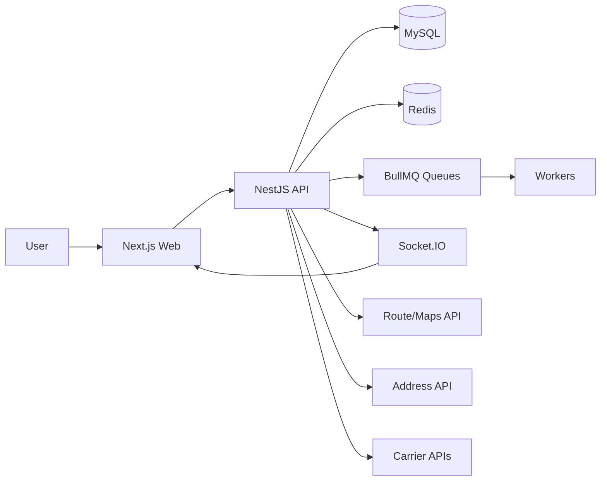
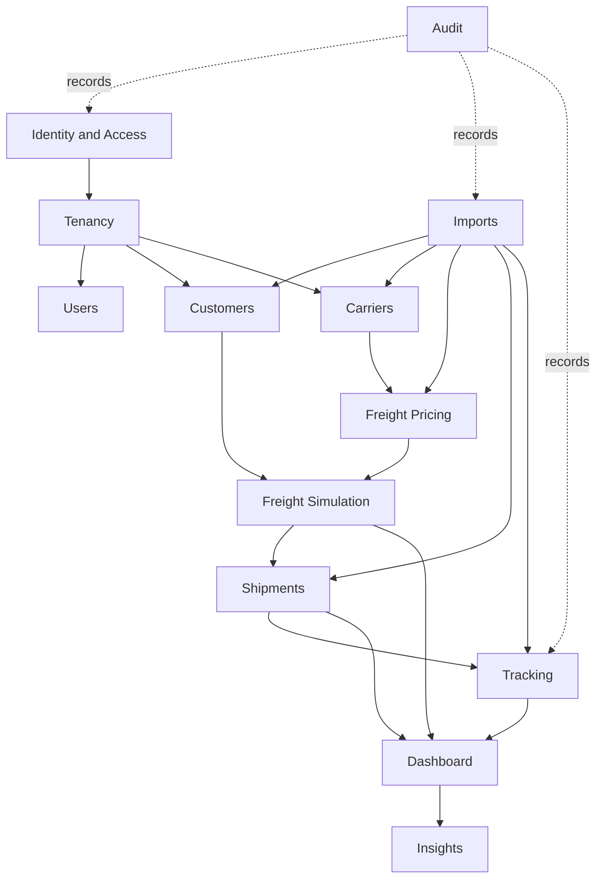

# Definicao De Dominio

Status: `IN_DESIGN`

## Posicionamento Do Produto

A plataforma e um SaaS multi-tenant de inteligencia logistica para controle de custo de frete, comparacao de transportadoras, monitoramento de execucao de shipments, ingestao de eventos de tracking, imports, dashboards operacionais e insights explicaveis.

O produto nao deve ser apresentado apenas como uma calculadora de frete. Simulacao de frete e um fluxo dentro de uma plataforma mais ampla de decisao logistica.

## Linguagem Central

- Tenant: empresa contratante que usa o SaaS.
- Branch: unidade operacional opcional de um tenant.
- Customer: cliente atendido pela operacao logistica do tenant.
- CustomerAddress: registro reutilizavel de endereco do cliente, nao snapshot historico de entrega.
- Carrier: transportadora configurada por um tenant.
- CarrierService: servico/modalidade oferecido por uma transportadora.
- FreightRateTable: regras de precificacao versionadas para servicos de transportadora.
- FreightSimulation: solicitacao de estimativa para comparar custo, prazo e risco.
- FreightSimulationOption: uma opcao retornada para uma simulacao.
- Shipment: operacao real de transporte.
- ShipmentAddress: snapshot imutavel de endereco usado por um shipment.
- ShipmentPackage: dados de pacote/volume usados em um shipment.
- TrackingEvent: fato logistico imutavel na timeline de um shipment.
- ImportJob: registro de processamento assincrono para arquivos enviados.
- AuditLog: registro de acao do sistema; separado de tracking logistico.
- Insight: recomendacao operacional ou anomalia explicavel.

## Fronteiras

FreightSimulation responde: quanto este frete poderia custar e qual opcao deveria ser selecionada?

Shipment responde: o que esta realmente sendo transportado, por quem, onde esta e o que aconteceu?

TrackingEvent responde: qual fato logistico ocorreu, quando, onde, a partir de qual origem e se alterou o status operacional?

AuditLog responde: quem fez o que no sistema, contra qual entidade, sob qual requisicao e com qual resultado?

## Diagrama De Contexto

## Modulos De Dominio Recomendados

## Recomendacoes De Dominio

1. Manter enderecos de cliente reutilizaveis, mas copiar snapshots de enderecos para `ShipmentAddress`.
2. Introduzir `CarrierService` antes da simulacao final de frete, porque campos no nivel da transportadora nao representam restricoes especificas por servico.
3. Introduzir `FreightSimulationOption`; nao conectar uma simulacao inteira diretamente a um shipment.
4. Introduzir `Shipment` como agregado operacional para tracking, dashboards, status de entrega e performance.
5. Tornar `TrackingEvent` imutavel. Correcoes devem criar novos eventos.
6. Armazenar status atual do shipment como estado desnormalizado atualizado transacionalmente por eventos de tracking que mudam status.
7. Manter auditoria separada de tracking. Tracking e a verdade logistica; auditoria e a responsabilizacao do sistema.
8. Comecar insights como regras deterministicas, nao IA generativa.

## Escopo De Dominio MVP

Dentro do escopo apos Identity and Access:

- usuarios tenant-aware;
- clientes e enderecos;
- transportadoras e servicos;
- precificacao de frete MVP;
- simulacoes de frete e opcoes;
- shipments;
- timeline de tracking;
- imports para um ou dois tipos explicitos de arquivo;
- KPIs de dashboard a partir de tabelas reais;
- insights baseados em regras.

Fora do escopo ate uma etapa posterior:

- marketplace de transportadoras;
- substituicao completa de TMS;
- motor de otimizacao de rotas;
- billing e assinatura;
- recomendacoes com IA generativa usando dados sensiveis;
- motor complexo de workflow.
