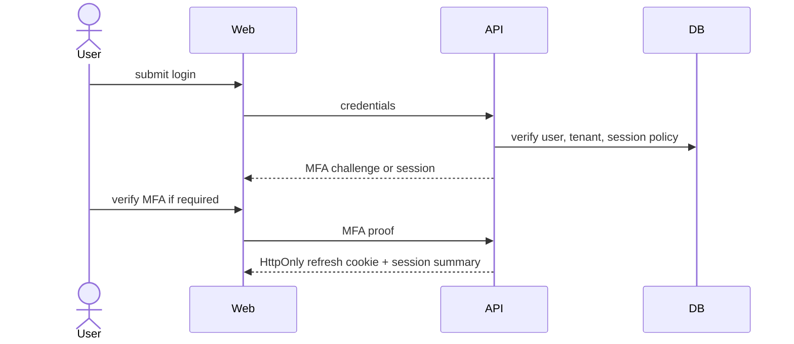
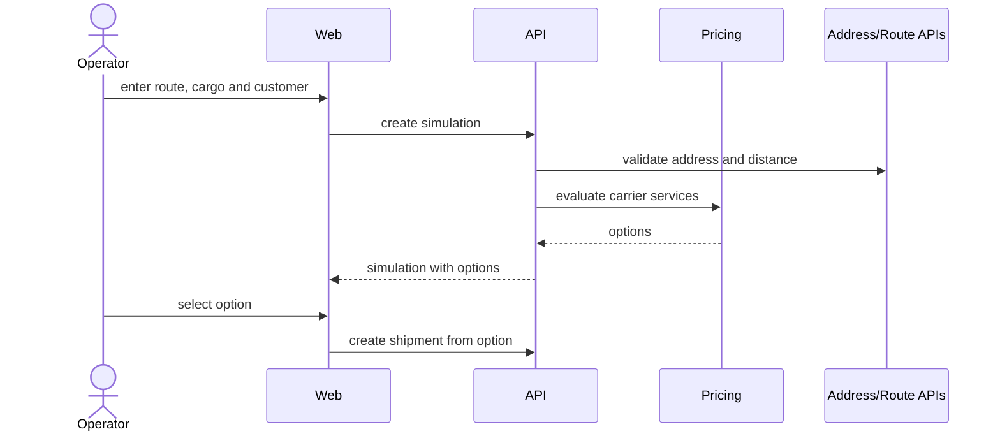
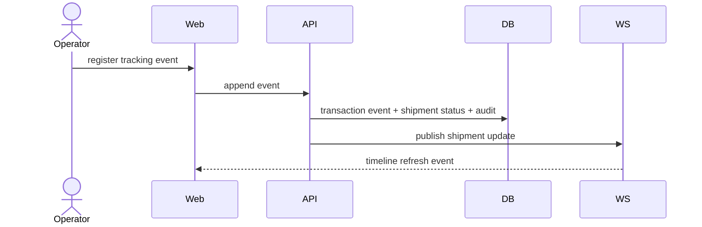

# User Journeys

Status: `IN_DESIGN`

## Personas

- Tenant Admin: configures users, roles, integrations, tenant settings, and audit review.
- Logistics Manager: monitors cost, SLA, carriers, exceptions, and insights.
- Operator: runs simulations, imports files, registers tracking events, and handles shipment exceptions.

## Journey: Login and Tenant Context

1. User opens login.
2. User authenticates with email/password or OAuth.
3. System challenges MFA when policy requires it.
4. Backend resolves tenant and membership from trusted identity.
5. Frontend receives session summary without refresh token exposure.
6. Dashboard loads with visible tenant, role, and period.

Failure states: invalid credentials, MFA required, user disabled, tenant disabled, no membership, session expired, rate limited.

## Journey: Freight Simulation

UX requirements: show validation next to fields, compare options in a table, explain selected recommendation, mark provider failures as partial data.

## Journey: Shipment Tracking

UX requirements: immutable timeline, current status summary, event source labels, out-of-order marker, correction events, and audit link for manual events.

## Journey: Import

1. Operator selects import type.
2. Upload validates extension, MIME, size, and spreadsheet safety.
3. System previews mapped columns.
4. Operator confirms processing.
5. API creates `ImportJob` and enqueues job.
6. Worker validates rows and writes records with idempotency.
7. WebSocket reports progress.
8. Result screen shows success count, warning count, error rows, and exportable report.

## Journey: Dashboard and Insights

1. Manager selects tenant, branch, and period.
2. Dashboard shows KPIs with source timestamp.
3. Manager filters by carrier, route, customer, status, or risk.
4. Insight cards explain rule, evidence, impact, and recommended action.
5. Manager dismisses, marks as read, or opens the underlying records.

## Journey: Administration

1. Admin invites user with role and optional branch scope.
2. System sends invitation and records audit.
3. User accepts invitation, sets password, configures MFA if required.
4. Admin reviews audit log for user and permission changes.

## Accessibility and Feedback

Every journey must define loading, empty, error, forbidden, partial data, offline, and retry states. Technical errors must map to user-facing recovery guidance and include request ID only when useful for support.
