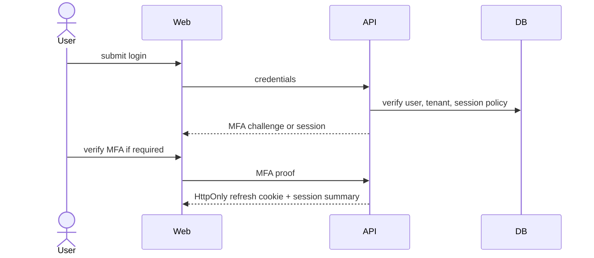
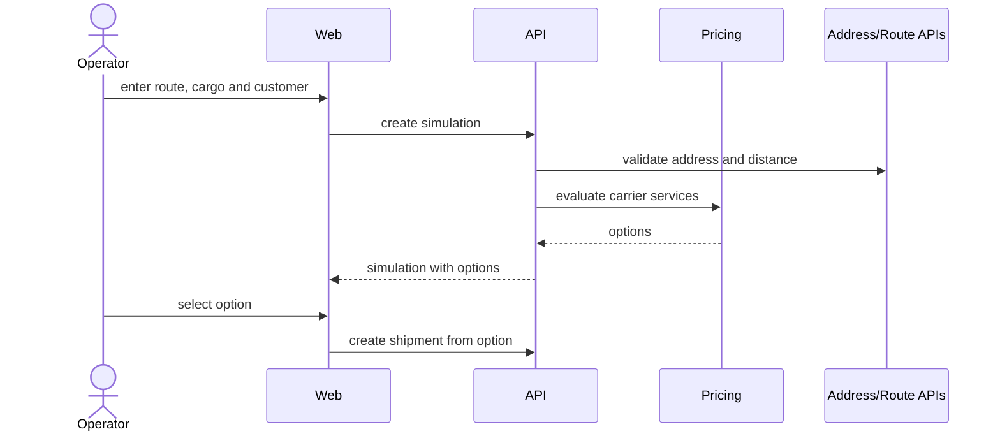
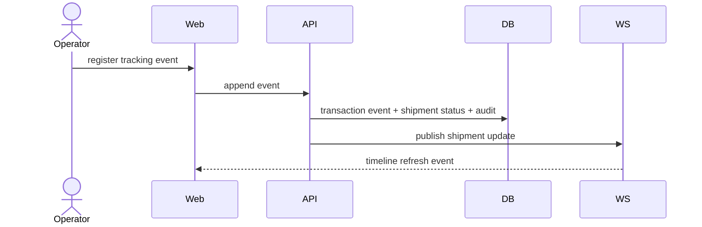

# Jornadas De Usuario

Status: `IN_DESIGN`

## Personas

- Admin do tenant: configura usuarios, roles, integracoes, configuracoes do tenant e revisao de auditoria.
- Gestor logistico: monitora custo, SLA, transportadoras, excecoes e insights.
- Operador: executa simulacoes, importa arquivos, registra eventos de tracking e trata excecoes de shipment.

## Jornada: Login E Contexto De Tenant

1. Usuario abre o login.
2. Usuario autentica com e-mail/senha ou OAuth.
3. Sistema solicita MFA quando a politica exige.
4. Backend resolve tenant e membership a partir de identidade confiavel.
5. Frontend recebe resumo de sessao sem expor refresh token.
6. Dashboard carrega com tenant, role e periodo visiveis.

Estados de falha: credenciais invalidas, MFA obrigatorio, usuario desabilitado, tenant desabilitado, sem membership, sessao expirada, rate limit.

## Jornada: Simulacao De Frete

Requisitos de UX: mostrar validacao junto aos campos, comparar opcoes em tabela, explicar a recomendacao selecionada e marcar falhas de provider como dados parciais.

## Jornada: Tracking De Shipment

Requisitos de UX: timeline imutavel, resumo do status atual, labels de origem do evento, marcador de evento fora de ordem, eventos de correcao e link de auditoria para eventos manuais.

## Jornada: Importacao

1. Operador seleciona o tipo de importacao.
2. Upload valida extensao, MIME, tamanho e seguranca da planilha.
3. Sistema exibe preview das colunas mapeadas.
4. Operador confirma o processamento.
5. API cria `ImportJob` e enfileira o job.
6. Worker valida linhas e grava registros com idempotencia.
7. WebSocket informa progresso.
8. Tela de resultado mostra contagem de sucesso, avisos, linhas com erro e relatorio exportavel.

## Jornada: Dashboard E Insights

1. Gestor seleciona tenant, filial e periodo.
2. Dashboard mostra KPIs com timestamp da fonte.
3. Gestor filtra por transportadora, rota, cliente, status ou risco.
4. Cards de insight explicam regra, evidencia, impacto e acao recomendada.
5. Gestor dispensa, marca como lido ou abre os registros relacionados.

## Jornada: Administracao

1. Admin convida usuario com role e escopo opcional de filial.
2. Sistema envia convite e registra auditoria.
3. Usuario aceita convite, define senha e configura MFA se exigido.
4. Admin revisa audit log de mudancas de usuario e permissao.

## Acessibilidade E Feedback

Toda jornada deve definir estados de loading, empty, erro, forbidden, dados parciais, offline e retry. Erros tecnicos devem ser traduzidos para orientacao de recuperacao para usuario e incluir request ID somente quando util para suporte.
