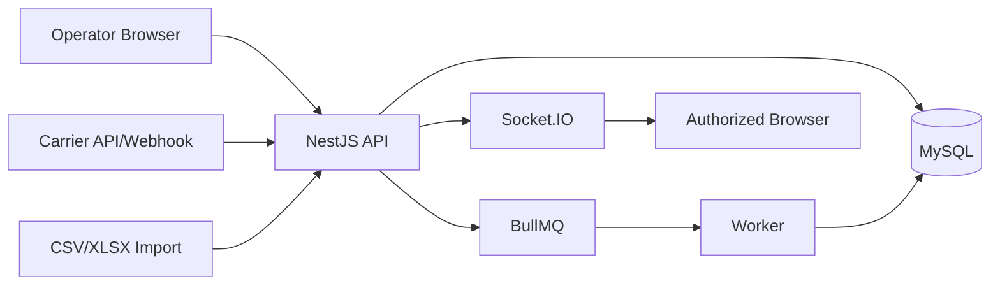

# Threat Model De Tracking

Status: `IN_DESIGN`

## Ativos Protegidos

- Status do shipment e timeline de entrega.
- Nomes de clientes, enderecos, codigos de tracking, valores de carga e dados de SLA.
- Performance de transportadoras e dados de excecao especificos de tenant.
- Arquivos de importacao e payloads de webhooks externos.
- Evidencias de auditoria para acoes manuais de tracking.

## Fronteiras De Confianca

## Ameacas Por Fluxo

| Fluxo | Ameaca | Controle |
| --- | --- | --- |
| Evento manual | Usuario registra evento para shipment de outro tenant | Resolver tenant pela sessao, consultar por `id + tenantId`, retornar not found indistinguivel |
| Evento manual | Operador define transicao de status proibida | Maquina de estados explicita e verificacoes de permissao |
| Importacao | Planilha injeta formula ou payload malicioso | Validacao de MIME/magic byte, neutralizacao de formula, quarentena assincrona |
| Importacao | Linhas duplicadas criam eventos duplicados | Chave de idempotencia por linha ou evento externo |
| API externa | Provider envia evento para tenant errado | Conta de integracao vinculada ao tenant e mapeamento de referencia do provider |
| Webhook | Replay ou webhook forjado | Verificacao de assinatura, janela de timestamp, unicidade de evento externo |
| Fila | Job processa tenant errado ou dado obsoleto | Envelope de job assinado/validado e worker recarregando tenant/recurso |
| WebSocket | Cliente entra em sala de outro tenant | Handshake autenticado e nomes de sala derivados pelo servidor |
| Dashboard | Agregacoes vazam contagens de outro tenant | Queries tenant-scoped e testes de agregacao |
| Auditoria | Payload sensivel registrado em before/after | Schema de auditoria sanitizado e politica de redacao |

## Controles De Seguranca Obrigatorios

- Nenhum `tenantId` vindo de body, query ou payload de socket controlado pelo usuario pode ser usado para autorizacao.
- Escritas de tracking exigem usuario autenticado ou credencial de integracao verificada.
- Toda mutacao de tracking grava `AuditLog` para acao manual/sistemica administrativa.
- Eventos externos exigem unicidade por `(tenantId, source, externalEventId)`.
- Todas as escritas que alteram status usam transacao.
- Mudancas para status terminal exigem permissao elevada ou evento de correcao.
- Respostas de erro evitam revelar se IDs de shipment cross-tenant existem.
- Payloads realtime contem apenas IDs e resumo, nao registros sensiveis completos.

## Casos De Abuso

1. Operador autenticado altera `tenantId` no payload e tenta entrar em outra sala.
2. Integracao externa repete um evento antigo `DELIVERED` depois que o shipment foi cancelado.
3. Arquivo de importacao repete uma linha 1000 vezes para inflar timeline e custos.
4. Usuario registra `DELIVERED` diretamente a partir de `CREATED`.
5. Usuario tenta inferir shipment de outro tenant por tracking code.

## Testes

- tenant errado retorna not found indistinguivel;
- role nao autorizada e negada;
- transicao de status invalida e rejeitada;
- evento externo duplicado e ignorado ou retorna sucesso idempotente;
- evento fora de ordem e armazenado sem corromper status atual;
- status terminal e protegido;
- entrada em sala WebSocket e negada para tenant/recurso nao autorizado;
- registro de auditoria e criado sem payload sensivel.
