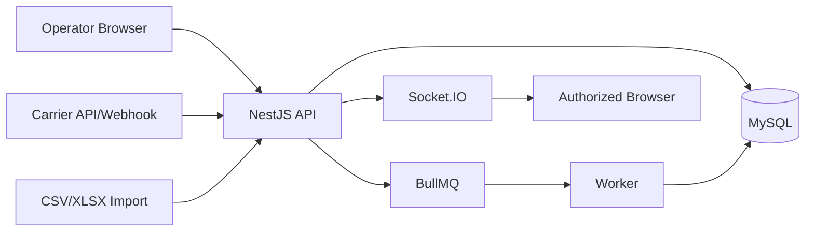

# Tracking Threat Model

Status: `IN_DESIGN`

## Protected Assets

- Shipment status and delivery timeline.
- Customer names, addresses, tracking codes, cargo values, and SLA data.
- Tenant-specific carrier performance and exception data.
- Import files and external webhook payloads.
- Audit evidence for manual tracking actions.

## Trust Boundaries

## Threats By Flow

| Flow | Threat | Control |
| --- | --- | --- |
| Manual event | User records event for another tenant shipment | Resolve tenant from session, query by `id + tenantId`, indistinguishable not found |
| Manual event | Operator sets forbidden status transition | Explicit state machine and permission checks |
| Import | Spreadsheet injects formula or malicious payload | MIME/magic byte validation, formula neutralization, async quarantine |
| Import | Duplicate rows create duplicate events | Idempotency key per row or external event |
| External API | Provider sends event for wrong tenant | Integration account bound to tenant and provider reference mapping |
| Webhook | Replay or forged webhook | Signature verification, timestamp window, external event uniqueness |
| Queue | Job processes tenant wrong or stale data | Signed/validated job envelope and worker reloading tenant/resource |
| WebSocket | Client joins another tenant room | Authenticated handshake and server-derived room names |
| Dashboard | Aggregates leak counts from another tenant | Tenant-scoped queries and aggregate tests |
| Audit | Sensitive payload logged in before/after | Sanitized audit schema and redaction policy |

## Required Security Controls

- No `tenantId` from request body, query, or user-controlled socket payload for authorization.
- Tracking writes require authenticated user or verified integration credential.
- Every tracking mutation writes `AuditLog` for manual/system administrative action.
- External events require `(tenantId, source, externalEventId)` uniqueness.
- All status-changing writes use a transaction.
- Terminal status changes require elevated permission or correction event.
- Error responses avoid revealing whether cross-tenant shipment IDs exist.
- Realtime payloads contain IDs and summary only, not full sensitive records.

## Abuse Cases

1. Authenticated operator changes `tenantId` in payload and tries to join another room.
2. External integration replays an old `DELIVERED` event after shipment was canceled.
3. Import file repeats a row 1000 times to inflate timeline and costs.
4. User registers `DELIVERED` directly from `CREATED`.
5. User attempts to infer another tenant shipment by tracking code.

## Tests

- wrong tenant returns indistinguishable not found;
- unauthorized role denied;
- invalid status transition rejected;
- duplicate external event ignored or returns idempotent success;
- out-of-order event stored without corrupting current status;
- terminal status protected;
- WebSocket room join denied for unauthorized tenant/resource;
- audit record is created without sensitive payload.
